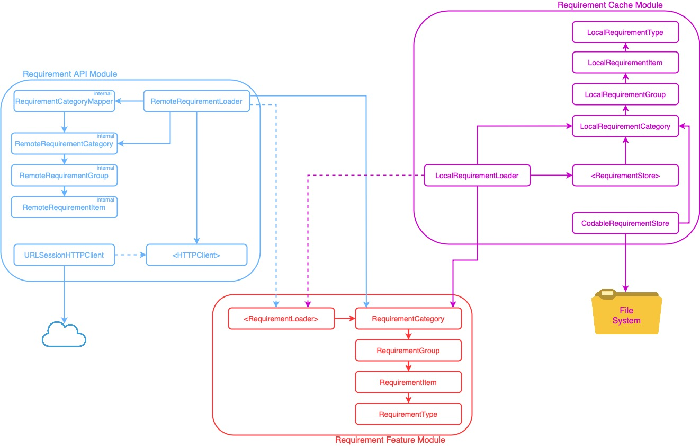

# Top 10% iOS Developer App Case Study


## BDD Specs

### Story: user requests to see the requirements

### Narrative #1
```
As an online user,
I want the app to automatically load the latest requirements
So I can always see the latest requirements to be a top 10% iOS dev
```

#### Scenarios (Acceptance criteria)
```
Given the user has connectivity
 When the user requests to see the requirements
 Then the app should display the latest requirements from remote
  And replace the cache with the new requirements
```

### Narrative #2
```
As an offline user,
I want the app to automatically load the latest saved requirements
So I can always see the requirements
```

#### Scenarios (Acceptance criteria)
```
Given the user doesn't have connectivity
  And there’s a cached version of the requirements
 When the user requests to see the feed
 Then the app should display the requirements saved
  
Given the user doesn't have connectivity
  And the cache is empty
 When the user requests to see the requirements
 Then the app should display an error message
```

## Use Cases

### Load requirements From Remote Use Case

#### Data:
- URL

#### Primary course (happy path):
1. Execute “Load Requirements” command with above data.
2. System downloads data from the URL.
3. System validates downloaded data.
4. System creates requirements from valid data.
5. System delivers requirements.

#### Invalid data - error course (sad path):
1. System delivers invalid data error.

#### No connectivity - error course (sad path):
1. System delivers connectivity error.

### Load requirements From Cache Use Case

#### Primary course (happy path):
1. Execute “Load Requirement items” command with above data.
2. System retrieves requirement data from cache.
3. System creates requirement items from cached data.
4. System delivers requirements.

#### Retrieval error course (sad path):
1. System delivers error.

#### Empty cache course (sad path):
1. System delivers no requirements.

### Validate requirements Cache Use Case

#### Primary course (happy path):
1. Execute “Validate Cache” command with above data.
2. System retrieves requirement data from cache.

#### Retrieval error course (sad path):
1. System deletes cache

### Save Requirements to Cache Use Case

#### Data:
- Requirement items

#### Primary course:
1. Execute "Save Requirement Items" command with above data.
2. System deletes old cache data.
3. System encode requirement items.
4. System saves new cache data.
5. System delivers success message.

#### Deleting error course (sad path):
1. System delivers an error.

#### Saving error course (sad path):
1. System delivers an error.

## Model Specs

### Requirement Category
| Property | Type                 |
|----------|----------------------|
| `id`     | `UUID`               |
| `name`   | `String`             |
| `groups` | `[RequirementGroup]` |

### Requirement Group
| Property | Type                |
|----------|---------------------|
| `id`     | `UUID`              |
| `name`   | `String`            |
| `items`  | `[RequirementItem]` |

### Requirement Item
| Property | Type              |
|----------|-------------------|
| `id`     | `UUID`            |
| `name`   | `String`          |
| `type`   | `RequirementType` |

### Requirement Type
| Case     | Associated value |
|----------|------------------|
| `level`  | `Int`             |
| `done`   | `Bool`           |
| `number` | `(Int, String)`  |

### Payload contract

```
GET /requirements

200 RESPONSE

{
    "categories": [
        {
            "id": "a UUID",
            "name": "a name",
            "groups": [
                {
                    "id": "a UUID",
                    "name": "a name",
                    "items": [
                        {
                            "id": "a UUID",
                            "name": "a name",
                            "type": "level"
                        }
                        ...
                    ]
                }
                ...
            ]
        }
        ...
    ]
}
```
## App Architecture


